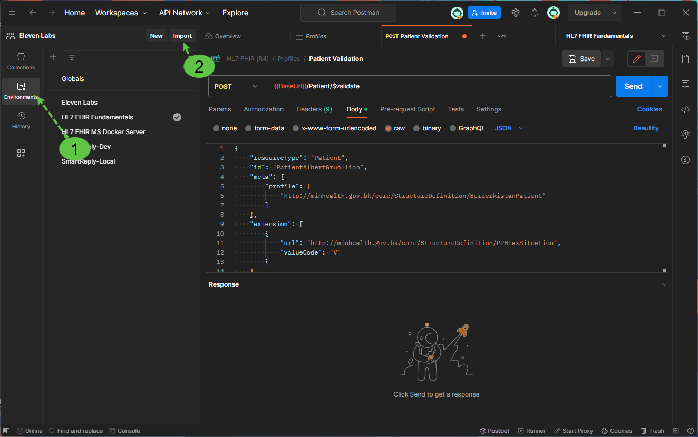
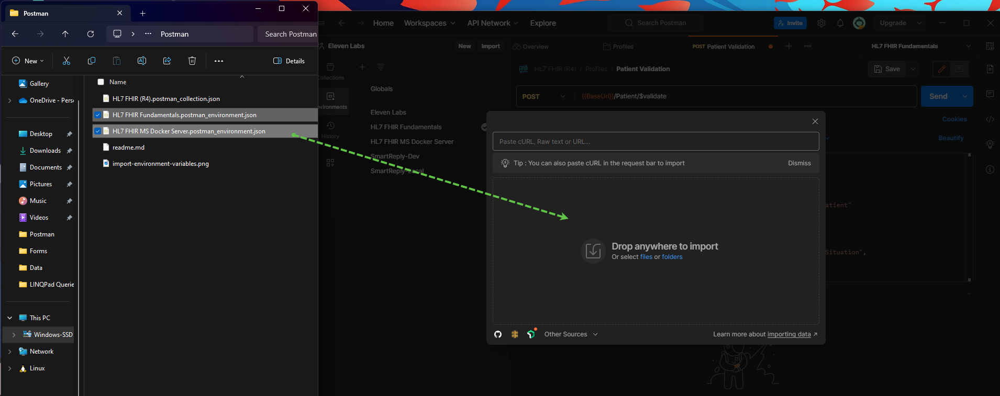
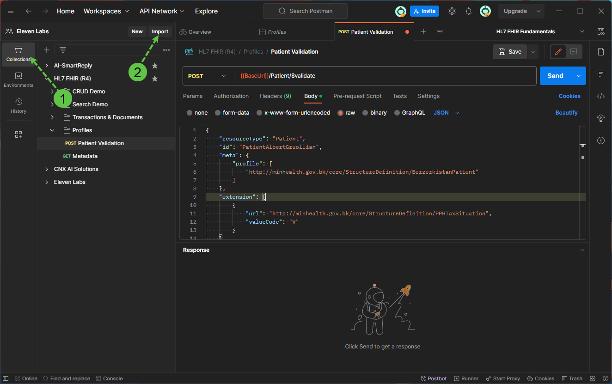
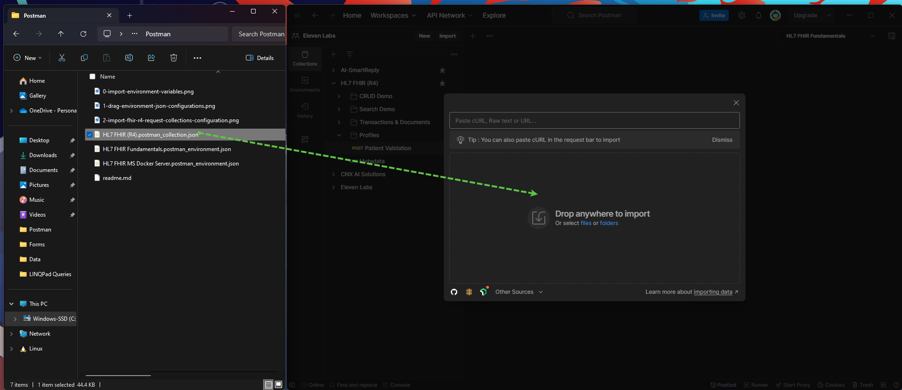

# Importing FHIR R4 Course Settings

### Import Environemnt Variables

>1. Go to environment imports

>2. Drag environment configurations

>3. Go to collection imports

>4. Drag collection configurations
